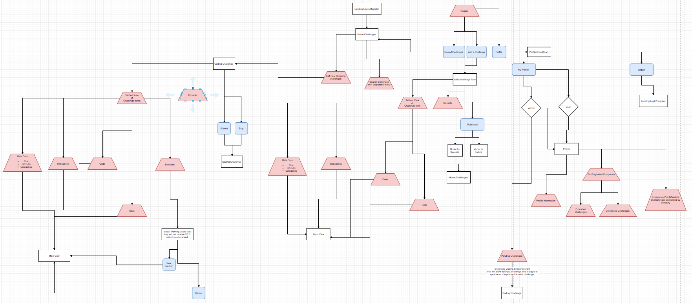

# Code Clone

 You can find the deployed project at:

[Front End](https://clone-coding-client.herokuapp.com)

[Backend End](https://clone-coding-server.herokuapp.com)

## Project Overview

Our app helps learn and master JavaScript in an entertaining manner. It is suitable for users of any level of knowledge. If you are master or totally beginner you will be able to find a lot of code challenges of different difficulty levels and also create your own challenges for users.  

- [Trello Board](https://trello.com/b/mS8o68sX/labs13-clone)

- [Product Canvas](https://docs.google.com/document/d/1a1hz8MjvYVNe1HGXz4M4E63-9sX2loYAHXT2BET1mO8/edit#heading=h.1jaf6eug9n0k)

- [UX Design files](https://projects.invisionapp.com/share/M5S7CBCB8PG#/screens/366238390) 

## Key Features

### User Profile View

  - Can view user profile information
  - View all challenges they already started
  - View all challenges they completed
  - View unapproved challenges they created
    - Edit unapproved challenges they created
  - Admins can get any unapproved challenges
    - Admins can edit unapproved challenges
    - Admins can approve a challenge

### Create Challenge View

  - Create a new code challenge
    - Create a description
    - Create a skeleton function
    - Create tests
        - Run tests
        - Console
            - Clear Console Button
    - Create a solution
        - Run solution
        - Console
            - Clear Console Button
  - Save Button

  
### Search Challenge View

  - Get any approved challenges
  - Optionally filter challenges by difficulty
  - Show challenges not completed by default
    - Optionally filter for challenges already completed
    - Users can retake a challenge they already completed
  - Allow users to start a code challenge

### Complete Code Challenge View

  - View Challenge Information
    - Title, Difficulty, Instruction, and Categories
  - Get the user's already existing submission
  - Save their answer
    - Either every X seconds or each time they make a change
  - Users can retake a challenge they already completed
  - Submit their answer for review
  - Skip the challenge and go to another
    - Same difficulty level

## Application Structure

 - Auth
    - Protected Route
    - Auth
    - Callback
 - Utility
    - WebWorker
 - Components
    - Views (A view represents a container for the components that comprise the view)
        - User Profile
            - Tabs
              - User
                - Completed Challanges
                - In progress challenges
                - Challenges they created (badge showing approved or unapproved)
              - Admin 
                - All tabs that the user's have access to
                - Unapproved Challenges with the ability to approve
            - User Card (Username, XP, Email)
        - Create Challenges
        - Search Challenges
          - List of challenges viewed as cards
          - Component that allows for filtering challenges
        - Complete A Challenge
            - Instructions Rendered in Markdown
            - Action bar that contains button to submit solution
        - Not Found (404)
        - LandingPage
    - Layout
        - Header
        - Main (Single View/Represents a Route)
        - Footer
    - Shared
        - Editor (Complete A Challenge & Create Challenge & Edit Challenge)
            - Lines Of Code
            - Markdown or Javascript
            - Buttons that to run code or run tests against solution
            - Toggle button to render either tests or skeleton function/solution
        - Console (Complete A Challenge & Create Challenge & Edit Challenge)
          - Clear console button
        - MetaData Form (Create Challenge & Edit Challenge)
        - Challenge Card (Search Challenges & User Profile Tabs)

## Tech Stack

#### React

-    Fast render with Virtual DOM 
-    Allows to use reusable UI components.
-    A good option for single page application.
-    Has great developer tools.

#### Front end deployed to `Heroku`

#### Node

-    Allows to write server-side applications in JavaScript.
-    We using the same language on both the front end and the back end.
-    Has a great package manager, npm, and a large amount of available open-source tools in npm’s registry.

#### Back end deployed to `Heroku`

# APIs

## Authentication API here

Auth0
  - GitHub Social Connection
  - Email and Password

## Backend API 

Node, Express, and Postgres

# Environment Variables

In order for the app to function correctly, the user must set up their own environment variables. There should be a .env.production and .env.development file containing the following:

* REACT_APP_DOMAIN - Either localhost or the remote location of where the app is hosted. 
* REACT_APP_CLIENTID - The client id that is provided by Auth0
* REACT_APP_CALLBACKURL - Either localhost or the remote URL that is required by Auth0 for receiving the access token and ID token. 
* REACT_APP_AUDIENCE - The API URL that that token will be used for. 
* REACT_APP_RETURNTO - Either localhost or the remote location that user is redirected to after logout

# Content Licenses

[MIT License](https://github.com/labs13-clone/front-end/blob/master/LICENSE.md)

# Testing
 - Jest 

# Installation Instructions
 
  * yarn install - installs NPM packages
  * yarn dev  - starts the development server

## Other Scripts

  * build - creates a build of the application
  * start - starts the production server after a build is created
  * test - runs tests in **tests** directory

# Contributing

When contributing to this repository, please first discuss the change you wish to make via issue, email, or any other method with the owners of this repository before making a change.

Please note we have a [code of conduct](./CODE_OF_CONDUCT.md). Please follow it in all your interactions with the project.

## Issue/Bug Request
   
 **If you are having an issue with the existing project code, please submit a bug report under the following guidelines:**
 - Check first to see if your issue has already been reported.
 - Check to see if the issue has recently been fixed by attempting to reproduce the issue using the latest master branch in the repository.
 - Create a live example of the problem.
 - Submit a detailed bug report including your environment & browser, steps to reproduce the issue, actual and expected outcomes,  where you believe the issue is originating from, and any potential solutions you have considered.

### Feature Requests

We would love to hear from you about new features which would improve this app and further the aims of our project. Please provide as much detail and information as possible to show us why you think your new feature should be implemented.

### Pull Requests

If you have developed a patch, bug fix, or new feature that would improve this app, please submit a pull request. It is best to communicate your ideas with the developers first before investing a great deal of time into a pull request to ensure that it will mesh smoothly with the project.

Remember that this project is licensed under the MIT license, and by submitting a pull request, you agree that your work will be, too.

#### Pull Request Guidelines

- Ensure any install or build dependencies are removed before the end of the layer when doing a build.
- Update the README.md with details of changes to the interface, including new plist variables, exposed ports, useful file locations and container parameters.
- Ensure that your code conforms to our existing code conventions and test coverage.
- Include the relevant issue number, if applicable.
- Pull Requests are merged by the repository admin and require that two other developers approve the pull request.

### Attribution

These contribution guidelines have been adapted from [this good-Contributing.md-template](https://gist.github.com/PurpleBooth/b24679402957c63ec426).

## Documentation

See [Backend Documentation](https://github.com/labs13-clone/back-end) for details on the backend of our project.
